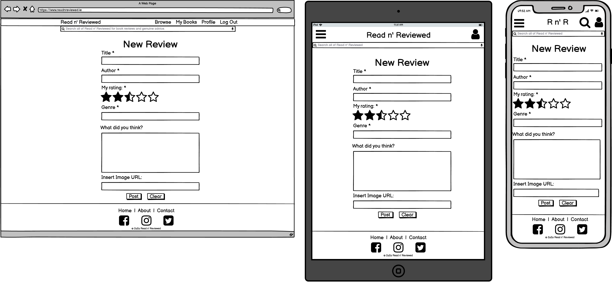
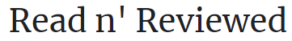
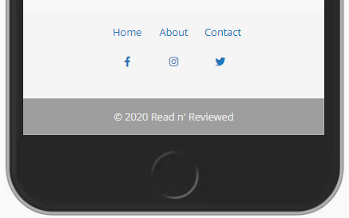
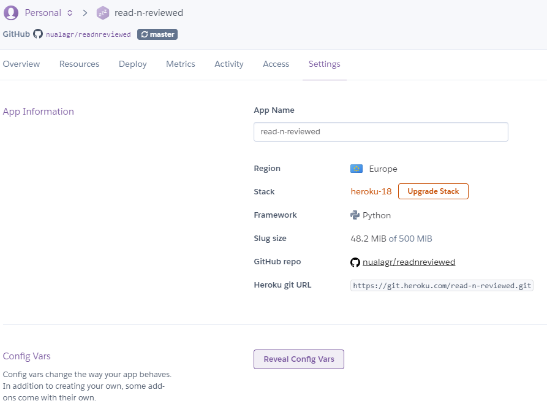

<h1 align="center">Read n' Reviewed</h1>


<sub>*Created using* [Am I Responsive](http://ami.responsivedesign.is/)</sub>
<br>

Read ‘n Reviewed is a fictitious book recommendation website. 
This is a community-led site on which members can share their book reviews with a view to helping others choose the perfect book to read next.

The site is geared towards avid readers.  Membership of the site provides users with the ability to contribute to the site by writing reviews, 
which can subsequently be edited or deleted, up-voting other members’ reviews, as well as providing users with a range of helpful tools including 
the ability to save books to a Wish List and providing them with links to an online store where their desired book can be purchased.

This project is the third of four Milestone Projects that make up the Full Stack Web Development Program at The Code Institute, the main requirements 
of which were to make a full-stack site that allows users to manage a common dataset about a particular domain using [HTML5](http://en.wikipedia.org/wiki/HTML5), 
[CSS3](http://en.wikipedia.org/wiki/CSS), [JavaScript](https://en.wikipedia.org/wiki/JavaScript), the JavaScript library [jQuery](https://jquery.com/)
, [Python](https://en.wikipedia.org/wiki/Python_(programming_language)), [Flask](https://en.wikipedia.org/wiki/Flask_(web_framework)) and the document-oriented database program
, [MongoDB](https://en.wikipedia.org/wiki/MongoDB).


Click <a href="https://read-n-reviewed.herokuapp.com/">here</a> to visit the site.
<br>

## **Table of Contents**
1. [**User Experience (UX)**](#ux)
    - [Project Goals](#project-goals)
    - [User Stories](#user-stories)
        - [Prospective User](#prospective-user)
        - [Existing User](#existing-user)
        - [Site Owner](#site-owner)
2. [**User Centered Design**](#user-centered-design)
    - [1) The Strategy Plane](#1-strategy-plane)
    - [2) The Scope Plane](#2-scope-plane)
    - [3) The Structure Plane](#3-structure-plane)
         - [Features](#features)
    - [4) The Skeleton Plane](#4-skeleton-plane)
        - [Wireframes](#wireframes)
    - [5) The Surface Plane](#5-surface-plane) 
        - [Design](#design)
        - [Colour Scheme](#colour-scheme)
        - [Icons](#icons)
        - [Typography](#typography)
3. [**Development**](#development)
    - [Information Architecture](#information-architecture)
        - [Data Storage Types](#data-storage-types)
        - [Collections Data Structure](#collections-data-structure)
4. [**Technologies Used**](#technologies-used)
5. [**Testing**](#testing)
    - [Performance](#performance)
    - [Responsiveness](#responsiveness)
    - [Tested User Stories](#tested-user-stories)
    - [Bugs](#bugs)
6. [**Deployment**](#deployment)
7. [**Credits**](#credits)
    - [Content](#content)
    - [Media](#media)
    - [Acknowledgements](#acknowledgements)

<br>

---

## UX
This section provides insight into the UX process, focusing on who Read ‘n Reviewed was created for, the main aims of the 
project and how the website can help users meet their needs.

Read n’ Reviewed is of direct interest to avid readers, who are the target market for its services.  The site seeks to 
provide them with a range of book recommendations by fellow readers enabling them to make more informed choices when choosing 
their next book to read.  As a site with many readers Read n’ Reviewed may also have commercial value for online book stores and for 
the site owner who seeks to gain financially from the direct referral of members to those stores to purchase their next book.  

### Project Goals
The goals of this project are to:
-	Make Read ‘n Reviewed appear to be a reputable website by creating a professional and intuitive interface.
-	Create a website that is visually appealing and fully responsive on all devices and screen sizes.
-	Present information about the Read ‘n Reviewed site so that visitors immediately comprehend what service it provides to its members. 
-	Allow visitors to easily contact the website administrator with any questions.
-	Encourage new members to sign up to the site.
-	Create an interactive website where a community of engaged readers can share their book reviews on the site.
-	Provide users with the functionality so that they can create, read, update and delete their own content.
-	Store the users’ data so that it is can be accessed when required.
-	Encourage members to up-vote other members’ reviews that they believe are helpful or that accurately reflect the nature of the book being reviewed.
-	Provide members with direct links to the books they desire in an online book store.

### User Stories

#### Prospective User

I am a prospective Read n’ Reviewed site member I want to be able to:

-	Immediately comprehend the purpose behind the Read n’ Reviewed site.
-	Easily find information outlining the features that it offers to registered members.
-	Read site members’ testimonials.
-	Read some book review samples.
-	Easily contact the site owner if I have any questions about the site.
-	Easily locate any social media accounts connected to the site.
-   Navigate through the site with ease.
-	Easily register to become a site member.

#### Existing User

I am an existing Read n’ Reviewed site member I want to be able to:

-	Log in to the site.
-   Navigate through the site with ease.
-	Log out of the site.
-	Edit my account information.
-	Read the most recent book reviews added to the site, which will give me an idea of what books are being read by other site members right now.
-	Search for my next book to read based on reviews written by fellow book lovers, reviews that are ranked by popularity.
-	Read general information about the books, including the authors’ names and the publication dates as well as being able to see images of the book covers.
-	Be facilitated in my goal of buying a specific book immediately through direct links to an online book store.
-	Search to see whether a book has already been reviewed on the site by entering the book title, or author into a search box within the site.
-	Search for books by genre by entering the desired genre into a search box within the site.
-	Share my own book reviews with fellow readers.
-	Input my own review easily into a user-friendly form that is straightforward to use. 
-	Edit or delete my own book reviews.
-	Be secure in the knowledge that no other user can edit or delete my reviews.
-	Be secure in the knowledge that measures have been put in place to prevent me from accidentally deleting one of my own reviews.
-	Up-vote other members’ reviews that I feel are helpful and accurately reflect the book being reviewed.
-	Curate my own Wish List of books that I would like to read in the future.
-	See a list of my own book reviews on the site.
-	Contact the site owner.


#### Site Owner
As the owner of Read n' Reviewed website I would like:

-	Provide site members with an effective and user-friendly platform where they can read book reviews written by other avid readers so that they make more informed choices when choosing their next book to read.
-	Provide site members with a user-friendly way to share their own reviews of books, edit those reviews or delete them as they see fit.
-	Present the reviews in a visually appealing format.
-	Provide an up-voting functionality for members to express their satisfaction with particular reviews.
-	Provide site members with the ability to search the site for a specific book by entering the title or the author into a search box within the site.
-	Provide users with general information about the books reviewed, including the author’s name and publication date and an image of the book cover.
-	Raise revenue by directing site members to a partner online book store where they can buy the books they are interested in.
-	Encourage more members to join the community by creating a professional-looking website that is intuitive to use and displays positive member testimonials on the landing page. 
-	Provide prospective members with the ability to sign-up easily.
-	Encourage more visitors to follow the site on social media and thereby raise the profile of the site.
-	Provide visible contact details so that all site visitors can contact the site administrator with ease.
-	Search for my next book to read based on reviews written by fellow book lovers.

<br>

##### back to [top](#table-of-contents)
---

## User Centered Design
### 1 Strategy Plane

The main goals of the website include attracting new members to sign up to the site and encouraging existing members to upload book reviews and recommend books to 
the community in order to increase participation on the site and ultimately raise revenue from the partner book store where members are encouraged to buy their books 
through the provision of direct links. The website is a Business to Consumer model aimed at a literary conscious audience. It should include minimal, relevant, 
content displayed in an attractive and intuitive manner. The UX process started with the creation of the User Stories above which helped to maintain a focus on user needs 
and business goals during the design process.  

<br>

##### back to [top](#table-of-contents)
---

### 2 Scope Plane

The key features of the website were developed based on user needs. 

Users should be able to do the following on the website:

-	Find out information about the site’s services.
-	Learn about the benefits of becoming a member.
-	Read testimonials written by site members.
-	Contact the site administrator with a question.
-	Easily access the site’s social media channels.
-	Learn more about the site and its ethos.
-	Sign up to become a member.
-	Log in to the site.
-	Log out of the site.
-	Upload a book review for a book that hasn’t yet been reviewed on the site.
-	Write and upload a book review for a book that has already been reviewed on the site.
-	View their own book reviews.
-	Edit their own book reviews.
-	Delete their own book reviews.
-	View other members’ book reviews.
-	Up-vote other members’ book reviews.
-	Create and curate their own Wish List of books that they want to read.
-	Search the site for a book by title or author.
-	Follow a link directly to an online store that sells the book in question.


<br>

##### back to [top](#table-of-contents)
---

### 3 Structure Plane
After identifying the needs of the site's users and after visiting book review and recommendation websites the following website design and features were chosen:

For ease of navigation there is a navigation bar at the top with the brand logo and links to other pages on the site.  
This collapses into the hamburger icon when viewed on a mobile or tablet screen.  
There is a common footer on each page with social media links, site administrator contact details and copyright information.
The site has different options for each of the following users: new visitors, site members and administrative users.  

1. **New visitors** to the site are able to see the public landing page which has four links on the navigation bar: Home, Browse, Log In / Register and Search.  
   -	The Log In page consists of a simple form asking for the member’s username and password.
   -	The Registration page consists of a simple form asking the visitor to enter their email address, a username and a password.
   -	The Home page or Landing page explains what membership to the site offers its users, it displays positive site member testimonials and the two latest books that have been reviewed on the site.
   -    The Browse page, where users can browse through the books on the Read n' Reviewed site.
   -    The Search page consists of a single search box where users can search for books on the site, by author or title.


2. **Site members** are able to log in to the site from the landing page.  Their logged in navigation bar consists of:
   -	A link to their Profile page which displays their username and email address.
   -    The My Reviews page displays a list of the user's reviews submitted to the site along with Edit and Delete buttons allowing the user to curate their own reviews. 
   -	A link to the New Review page consisting of a form where they can input their new review and submit it to the database.  
   -	The My Wish List page consists of a grid of book covers, that the member has earmarked for future reading. There are links to those books as they have been reviewed on the site along with 
   links to buy the books. A simple bookmark icon beside each book allows the user to easily remove any book from the Wish List. 
   -    The Browse page, where users can browse through the books on the Read n' Reviewed site.
   -	A Log Out button.
   -    The Search page where users can search the site for any book by title or by author.  If no book currently exists on the 
   site the logged in user is brought to the Add Book page and allowed to search for the edition they want and add it to the site.


3. **Administrative Users** will be able to see the public site:
   -	Landing Page
   -	Log In Page
   -	Log Out button
   -	Registration Page
   -    Browse Page
   -	Administrator Profile Page
   -    My Reviews Page
   -	My Wish List Page

<br>

### Features

This is a multi-page site.  

<br>

### Existing Features
Consistent features across all pages:

A book **favicon**, displayed on the web browser's tab allows the user to identify the website by sight.

The **Title**, displayed on the web browser's tab at all times, clearly identifies the site as a book review website.

**Search icon**  - located on the navigation bar on the desktop, ipad and mobile views this feature opens the search page and allows users to search the entire site for a specific book by title or by author without having to click on a separate button or tab.

**Logo/Home button** - Visible at all times, this feature foregrounds the website's brand and allows the user to navigate back to the home page without requiring an extra click.

**User Icon button** - Visible at all times, this feature allows users to view their profile or login or out of the site.

A **footer** contains a link to the **About** section on the landing page that explains the website's ethos, a link to the **Contact Us** page 
so that users can contact the site administrator and **social media** links to:

- [Facebook](https://www.facebook.com)
- [Twitter](https://twitter.com)
- [Istagram](https://www.instagram.com) 

<br> 

### Features Left to Implement
-	Provide users with **individualised recommendations** based on their previous reviews and upvoting behaviour.
-	A **membership ezine** based on activity on the site – most popular books in different genres etc.


<br>

##### back to [top](#table-of-contents)
---

### 4 Skeleton Plane

The UI wireframing tool, [Balsamiq](https://balsamiq.com/) was used to create wireframes for each page as they will appear on desktop, tablet and mobile devices.
Main content areas were expressed in similar ways, to create consistency.  

After visiting existing book review sites including [GoodReads](https://www.goodreads.com/), [BookPage](https://bookpage.com/), 
[LoveReading](https://www.lovereading.co.uk/), [SFBook Reviews](https://sfbook.com/) and [Reedsy Discovery](https://reedsy.com/discovery), 
it was deemed necessary to place a search icon on the navigation menu on all screens. 
It was also deemed necessary to include a user icon on the top left of the navbar.
The prioritisation of these function, through their placement outside of the collapsible menus on the competitor sites, indicates that these 
functions are the most commonly used, or desired, by book review site users.  


<br>

#### Wireframes

- [Home Page](https://github.com/nualagr/readnreviewed/blob/master/documentation/wireframes/home.png)


- [Login Page](https://github.com/nualagr/readnreviewed/blob/master/documentation/wireframes/login.png)


- [Registration Page](https://github.com/nualagr/readnreviewed/blob/master/documentation/wireframes/register.png)


- [Contact Page](https://github.com/nualagr/readnreviewed/blob/master/documentation/wireframes/contact.png)


- [User Profile](https://github.com/nualagr/readnreviewed/blob/master/documentation/wireframes/profile.png)


- [Browse Page](https://github.com/nualagr/readnreviewed/blob/master/documentation/wireframes/browse.png)


- [Individual Book Review Page](https://github.com/nualagr/readnreviewed/blob/master/documentation/wireframes/book-review.png)


- [My Reviews Page](https://github.com/nualagr/readnreviewed/blob/master/documentation/wireframes/my-reviews.png)


- [New Review Page](https://github.com/nualagr/readnreviewed/blob/master/documentation/wireframes/new-review.png)


- [Edit Review Page](https://github.com/nualagr/readnreviewed/blob/master/documentation/wireframes/edit-review.png)


- [Wish List Page](https://github.com/nualagr/readnreviewed/blob/master/documentation/wireframes/wish-list.png)


<br>

##### back to [top](#table-of-contents)
---

### 5 Surface Plane

#### Design

The perceived audience for the Read n’ Reviewed site are avid readers. 
They are busy people who do not want to waste their time and money buying books that don’t fulfil their needs or desires. 
They want to make informed choices about their reading material.  They want to read unbiased opinions. 
They also want a handy location to save a list of the books they want to read/purchase next. 
Users who are more likely to want to keep a digital copy of their Wish List and who want to purchase books online are likely to be mobile users
, therefore a mobile-first approach was adopted when it came to designing the site.

#### Colour Scheme
To keep the visual design simple and modern a white background was used for the site.  
This design follows that of similar competitors including [BookPage](https://bookpage.com/), 
[LoveReading](https://www.lovereading.co.uk/), [SFBook Reviews](https://sfbook.com/) and [Reedsy Discovery](https://reedsy.com/discovery).  
Colour on these sites is limited to the use of one or two accent colours.  
This simple colour scheme allows the featured book covers to stand out and to grab the user’s attention. A 
similar approach was adopted on the Read n' Reviewed site. The accent colours of cyan and saffron were chosen.


<br>

To make it easier to scan the page for information the user might need, the complimentary accent colours of cyan and saffron, 
which are found in the site logo, were used to draw attention to links and call-to-action buttons.  

<br>


-	To keep the design clean, and professional the navigation bar is #FFFFFF, white, matching the background of the body each page. 
-	The background colour of site is also #FFFFFF, white, to keep the website’s image clean and to provide easy contrast.
-	#CCCCCC, light gray, has been used to indicate changes in content areas and for horizontal dividers between sections.
-	When a user scrolls or hovers over the links on the navigation bar the background changes to a light grey in order to provide the user with visual feedback.  
-	Light gray, #CCCCCC, has been used for the Footer, with eerie black, #222222, text.  To provide visual feedback to the user the social media and other links in the footer turn from blue to eerie black when hovered over. 
-	Deep Saffron, #F69222, has been used as an accent colour throughout the site, from the logo to call-to-action buttons and the star rating stars.
-	Text colour throughout the site is Eerie Black (#222222) in colour, which provides a strong contrast to the other colours in the site.  The use of this colour ensures that the text should be legible and meet accessibility standards regardless of the background colour of the element in question.

#### Icons

As there is a lot of text within the site content it was decided that self-explanatory icons would be utilised as buttons as much as possible to reduce 
the amount of reading necessary to operate the site.  
For example, a magnifying glass icon was used instead of a ‘Search’ button.   The icons used were taken from [Font Awesome](https://fontawesome.com/).

<br>

##### back to [top](#table-of-contents)
---

#### Typography
As the nature of the website involves reading reviews within the site it was necessary to choose a font that was easy to read on a screen.  
The two fonts chosen for the site were among the fourteen most legible fonts for reading online according to 
[Thrive](https://thrive.design/best-fonts-for-reading-easiest-to-read-online-design-fonts/).

The *Merriweather* font was chosen for as the main heading font.  



This font was designed to be pleasant to read on screens.  

<br>

To ensure the readability of smaller text on a mobile screen *Open Sans* was chosen for the main text used within the body of the site.  
This font remains legible even when the typeface is small. 


<br>


##### back to [top](#table-of-contents)
---

## Development

## Information Architecture

A SQL database structure would have been ideal for storing the data in this project, however one of the requirements for this project involved the use of MongoDB, a NoSQL, general purpose, document-based database.

### Data Storage Types
The types of data stored in MongoDB for this project are:
-	ObjectId
-	String
-	DateTime
-   Integer

### Collections Data Structure
Initially the data was broken up into five database collections: Users, Reviews, Books, Authors and Genres.
However after reading about normalization on [StackOverflow](https://stackoverflow.com/questions/24839147/is-it-needed-to-normalize-your-database-when-you-are-using-mongodb#:~:text=1%20Answer&text=Normalizing%20your%20data%20like%20you,between%20tables%20are%20relatively%20cheap.)
it was decided to combine the books, authors and genre collection into one. In that way 
the most common queries can be satisfied by querying two collections, Books and Reviews, even though this means that there will be some redundancy in the database.

The Read n’ Reviewed website relies on three database collections:


#### Users Collection
| Title	        |Key in db	    |form validation type	|Data type  |
| :------------ |:--------------| :---------------------|:--------- |
|User ID        |_id	        |None	                |ObjectId   |
|Username	    |username	    |text, maxlength="40"   |string     |
|Password	    |password	    |text, maxlength="40"	|string     |
|Email Address	|email	        |email, maxlength="40"  |string     |
|Password	    |password	    |text, maxlength="15"	|string     |
|Wish List      |wishlist       |checked box            |Array of ObjectIds - Book ID     |

<br>

#### Books Collection
| Title	            |Key in db	    |form validation type	|Data type  |
| :------------     |:--------------| :---------------------|:--------- |
|Book ID            |_id            |None                   |ObjectId   |
|Thumbnail          |thumbnail      |None                   |string of the book cover url     |
|Title	            |title	        |text, maxlength="200"  |string     |
|Authors            |authors        |text, maxlength="100"  |array of strings     |
|Category           |category       |None                   |string     |
|Description        |description    |None                   |string     |
|Publisher          |publisher      |None                   |string     |
|Published Date     |published_date |None                   |string     |
|Page Count         |page_count     |None                   |integer    |
|ISBN	            |isbn           |None                   |string     |
|Text Snippet       |text_snippet   |None                   |string     |

<br>

#### Reviews Collection			
| Title	        |Key in db	    |form validation type	|Data type  |
| :------------ |:--------------| :---------------------|:--------- |
|Review ID      |_id            |None                   |ObjectId   |
|Book ID        |book_id        |None                   |ObjectId   |
|Rating	        |rating         |dropdown menu          |string     |
|Review	        |review         |text                   |string     |
|Reviewer       |created_by     |None                   |string     |
|Date           |review_date    |None	                |datetime   |
|Review Score   |review_score   |None                   |integer    |
|Upvoters       |upvoters       |None                   |array of strings, usernames     |

<br>

##### back to [top](#table-of-contents)
---


## Technologies Used

- Languages: 

  * [HTML5](http://en.wikipedia.org/wiki/HTML5). Used to create the structure of the Read n' Reviewed website and the custom 404 page.
  * [CSS3](http://en.wikipedia.org/wiki/CSS). Used to add style to the website. 
  * [JavaScript](https://en.wikipedia.org/wiki/JavaScript). Used to create the dynamic, interactive elements of the website such as the carousel and to call the Google Books API.
  * [Python](https://en.wikipedia.org/wiki/Python_(programming_language)).  Used to create and run the web application.
  * [Jinja](https://en.wikipedia.org/wiki/Jinja_(template_engine)).  Used to simplify displaying data from the backend of this project smoothly and effectively in html.
  
- Websites
  * [Am I Responsive](http://ami.responsivedesign.is/). Used to create the mock-up image showing the site as it would behave when viewed on desktop, mobile and tablet devices. 
  * [Code Institute](https://codeinstitute.net/). Used to review concepts covered in preceding modules and walk-through projects. 
  * [Coolors](https://coolors.co/ffbe0b-fb5607-ff006e-8338ec-3a86ff). Used to analyse the site logo to isolate the colours used within and to construct the colour palette for the site.
  * [Emailjs](https://emailjs.com/). Used to connect EmailJS to gmail, create an email template, and use their Javascript library to trigger an email with dynamic variables that are populated from the Contact Us form.
  * [Font Awesome](https://fontawesome.com/). Used to source the free icons that were used for the social media links in the footer and for the profile, home, edit, delete and search buttons.
  * [Google Chrome Developer Tools](https://developers.google.com/web/tools/chrome-devtools). Used throughout the project to test the responsiveness of elements, to target and apply CSS styles during the design phase and to test the site's performance once built. 
  * [Google Fonts](https://fonts.google.com/). Used to choose and source the font used in the body of the site.
  * [Github](https://github.com/). Used as a respository for all previous versions of the build.
  * [Gitpod](https://www.gitpod.io/). This online IDE was used to build and develop the website.
  * [Heroku](https://www.heroku.com/). The cloud platform used to host the deployed site.
  * [Infoheap](https://infoheap.com/python-lint-online/).  Used to validate the Python app.py code.
  * [jQuery](https://jquery.com/). This JavaScript library was used to traverse the DOM and used for dynamic event handling. 
  * [Pep8online](http://pep8online.com/).  Used to check the app.py file for PEP8 compliance.
  * [RandomKeyGen](https://randomkeygen.com/). Used to generate the Secret Key.
  * [Slack](code-institute-room.slack.com). Used during development and testing to find the solutions to problems enountered.
  * [Stack Overflow](https://stackoverflow.com/). Used to search for the answers to problems encountered during the development and testing of the website.
  * [TinyPNG](https://tinypng.com/). Used to compress the site logo to improve performance results.
  * [Vecteezy](https://www.vecteezy.com/vector-art/599621-book-reading-logo-and-symbols-template-icons). Used to source the site icon and the custom 404 page background.
  * [W3C CSS Validation Service](https://jigsaw.w3.org/css-validator/validator). Used to validate the CSS file.
  * [W3C HTML Validation Service](https://validator.w3.org/). Used to validate the HTML files.

- Frameworks
  * [Materialize Framework](https://materializecss.com/). Used to structure the website layout and ensure that it was responsive on all devices.
  * [Flask](https://en.wikipedia.org/wiki/Flask_(web_framework)).  Python web framework.

- Database
  * [MongoDB](https://en.wikipedia.org/wiki/MongoDB), the document-oriented database program.  Used to store the users' information, book reviews and other data.

- APIs
  * [Google Books API](https://developers.google.com/books). Used to source the book synopsis, author information and book covers.

- Apps:
  * [Balsamiq](https://balsamiq.com/). Used to create the project wireframes.
  * [Inkscape](https://inkscape.org/). Used to edit the Vecteezy svg.

##### back to [top](#table-of-contents)
---

## Testing

Before the second meeting with my mentor the project was run through linters and validators.

### HTML files
[W3C HTML Validation Service](https://validator.w3.org/) was used to validate the HTML code. 
The home page produced the following error regarding the Materialize carousel div elements which have an href attribute.


<br>

Posts on [Stack Overflow](https://stackoverflow.com/questions/18824009/attribute-href-not-allowed-on-element-button-at-this-point) suggested changing the attribute to a 'data-' attribute.
This succeeded in removing the error.


<br>
### CSS files
[W3C Jigsaw CSS Validator](https://jigsaw.w3.org/css-validator/validator) was used to validate the CSS file.  No errors were found.

<br>

### JavaScript File
When the script.js file was entered into [JSHint](https://jshint.com/) it returned many warnings regarding the use of square-bracket, as opposed to dot notation.


<br>

Although square-bracket notation is valid, the dot notation is preferred because it is easier to read and works better with aggressive JavaScript minimizers.

Each instance highlighted by JSHint was changed to dot notation.


<br>

### Python File
[pep8online.com](http://pep8online.com/) was used to check whether the app.py Python file was PEP8 compliant.

<br>

When the same code was run through the [infoheap](https://infoheap.com/python-lint-online/) Python linter however it showed the following error:

<br>
I am grateful to my mentor Mr. Reuben Ferrante for pointing out the solution to this problem, reversing the order of the arguments, placing the _scheme and _external ahead of the args and kwargs. 

The app.py file now passes through the linter with no errors.


<br>

### Chrome Developer Tools

<br>
Chrome Developer Tools console highlighted the above violation, however it relates to non-passive event listeners within the Materialize JavaScript script.
Solutions have so far been unsuccessful in solving this issue.

### Performance
Google Chrome Developer Tools Lighthouse test was used to test the quality of the various pages on the website. Overall performance and errors are highlighted below.

<br>

The low-performance result was mainly driven by the following metrics:


<br>

Images:

Using the image compressor [TinyPNG](https://tinypng.com/) the site logo, 
community icon and banner image were compressed to increase performance.

As the book cover images are sourced from the Google Books API and rendered using the image URL the quality or actual size of the images 
provided is currently beyond control. 

The suggested next-gen formats, such as WEBP, are currently limited to certain browsers therefore, until they are more widely adopted, the icons and banner image used remain in png or jpg format.

In order to improve loading times the loading attribute was added to all img tags on the site and lazy loading was applied to those images not visible above the fold.

Render-blocking Resources:

The render-blocking resources that Lighthouse identified as slowing performance relate to 
Fontawesome and Materialize CSS CDNs and therefore could not be improved upon.  

Remove unused CSS and JavaScript:

The improvements suggested in relation to unused CSS related to the Font Awesome CSS CDN 
and the Materialize CSS CDN. The JavaScript files that Lighthouse highlighted as being 'unused'
were the JQuery and Materialize files.


The steps taken, although limited, resulted in a noticeable improvement in Performance results.

<br>
##### back to [top](#table-of-contents)
---

### Responsiveness

##### back to [top](#table-of-contents)
---

### Tested User Stories

#### Prospective User

I am a prospective Read n’ Reviewed site member I want to be able to:

&#9745;	Immediately comprehend the purpose behind the Read n’ Reviewed site.

Upon opening the homepage the user is presented with a banner heading, "Uncover Your Next Great Read!", which succinctly encapsulates the purpose of the site.
This is expanded upon in the subheading, "Join our community. Read honest reviews. Share your recommendations.", which alerts the visitor to the 
fact that this is a community-led site, whose aim is to allow users to share their book reviews and recommendations.


<br>

&#9745;	Easily find information outlining the features that are offered to registered members.

On the Read n' Reviewed home page, beneath the banner head and subheading, which explain the site's purpose, there is an About Us section which explains the site's ethos
and features, such as the Wish List, where members can save a list of the books they want to read next. 


<br>
A link to the About Us section is provided in the site footer, available on every page, to facilitate ease of navigation to this key information.


<br>

&#9745;	Read site members’ testimonials.

A carousel of member testimonials is provided on the home page so that prospective members can read 
what Read n' Reviewed members think about the site.


<br>

&#9745;	Read some book review samples.

On the homepage, new visitors are presented with the book covers, title, author, category and a text-snippet of the two latest books to be reviewed by Read n' Reviewed members. 


<br>

A link, 'View book...' brings the visitor to the page displaying the book summary and all of its associated book reviews, ordered by up-vote rating and date entered.


<br>

&#9745;	Easily contact the site owner if I have any questions about the site.

In the site footer, available on every page, there is a link to the Contact Us page.

<br>

This page consists of a clearly labelled form (using intuitive icons and placeholder text), 
which the visitor can fill in with their name, email address and enquiry and send it directly to the site administrator.


<br>

&#9745;	Easily locate any social media accounts connected to the site.

In the site footer, available on every page, there are links to the Read n' Reviewed social media accounts on Facebook, Instagram and Twitter.


<br>

&#9745; Navigate through the site with ease.

As well as the links to the Homepage, About Us page, Contact Us form and social media links which are available in the site footer, 
site navigation is also facilitated by the navigation bar at the top of each page.


<br>
New visitors on a desktop device have the option of clicking on the Read n' Reviewed logo or title to bring them back to the homepage. 

On a mobile device the menu is accessed through the hamburger icon. When clicked it reveals a side-navigation bar with the options available.


<br>

New visitors are presented with the option of visiting the Browse.html page where they can browse through all of the reviews on the Read n' Reviewed site.


<br>

Similarly, they can access these reviews by entering a specific title or author in the search form on the Search.html page, which is represented by the magnifying-glass logo on the navbar.


<br>

The user icon, visible at all times on the navbar in desktop or mobile view, expands into a dropdown menu and offers the option of navigating to the Login page or the Register page.


<br>

&#9745;	Easily register to become a site member.

As well as the link on the navbar, two other eye-catching call-to-action buttons, 
located on the home page, also facilitate easy navigation to the register.html page.


<br>

The registration form itself is a clearly laid out form, with intuitive icons to aid understanding,
such as the use of the lock symbol beside the password input field.  Tooltips appear when the fields 
are hovered over.  These clearly state what format the username and password should take.


<br>

#### Existing User

I am an existing Read n’ Reviewed site member I want to be able to:

&#9745;	Log in to the site.

&#9745; Navigate through the site with ease.

&#9745;	Log out of the site.

&#9745;	Edit my account information.

&#9745;	Read the most recent book reviews added to the site, which will give me an idea of what books are being read by other site members right now.

&#9745;	Search for my next book to read based on reviews written by fellow book lovers, reviews that are ranked by popularity.

&#9745;	Read general information about the books, including the authors’ names and the publication dates as well as being able to see images of the book covers.

&#9745;	Be facilitated in my goal of buying a specific book immediately through direct links to an online book store.

&#9745;	Search to see whether a book has already been reviewed on the site by entering the book title, or author into a search box within the site.

&#9745;	Search for books by genre by entering the desired genre into a search box within the site.

&#9745;	Share my own book reviews with fellow readers.

&#9745;	Input my own review easily into a user-friendly form that is straightforward to use. 

&#9745;	Edit or delete my own book reviews.

&#9745;	Be secure in the knowledge that no other user can edit or delete my reviews.

When viewing reviews within the site, a logged-in user can see that the Edit and Delete buttons and their associated functionality
are only offered in relation to the reviews that they themselves have authored.


<br>

Similarly, when the user logs out of the site these buttons disappear.  It is only logged in users who can edit their own reviews.


<br>

&#9745;	Be secure in the knowledge that measures have been put in place to prevent me from accidentally deleting one of my own reviews.

When a user chooses to press the delete button next to one of their reviews a modal appears which offers them the choice to reconsider their decision and retain their review.
If they still wish to delete the review they can confirm their decision by choosing the red Delete button within the modal.


<br>

&#9745;	Up-vote other members’ reviews that I feel are helpful and accurately reflect the book being reviewed.

When viewing a book and its associated reviews, members are presented with an Upvote Review button next to other site members' reviews.
The button enables them to up-vote the review in question if they feel that it was helpful or accurate. 
The Upvote buttons disappear once they have been used, preventing members from voting for the same review multiple times.  


<br>

&#9745;	Curate my own Wish List of books that I would like to read in the future.

A site member, when logged in, can access their Wish List using the link in the navigation bar, or in the compressed hamburger menu on a mobile device.
This link brings the site member to a page where the book cover, title and author are presented in individual cards.  


<br>

Each card also contains a bookmark icon
which, when clicked, removes the book from the wishlist.  Two buttons, with explanatory icons, are displayed in each card.  The blue button with the shopping
bag icon, brings the user to the Amazon search result page for that book title and author.  The white, View Book, button brings the user to the view_book.html
page for that book and its associated reviews.


<br>


&#9745;	See a list of my own book reviews on the site.

A site member can access their book reviews using the My Reviews link in the navigation bar.  This brings the user to a page where
the book cover image, title, author, rating, date and upvotes for each book reviewed are presented 
to the user in a list format. 


<br>

The book review itself can be seen by clicking on the Read review... link which takes the
user to a page displaying the book's information and that user's review.


<br>


&#9745;	Contact the site owner.

At the bottom of each page, in the site footer, there is a link to the Contact Us page.

<br>

This page consists of a form, which the site member can fill out.  
It provides the member with three input fields, which are clearly labelled with text and explanatory icons.
The user is asked for their name, email address and enquiry.  Submitting the form sends an email containing this information directly to the site administrator.


<br>


#### Site Owner

<br>

##### back to [top](#table-of-contents)
---

### Bugs
### [Timestamp Issue](https://github.com/nualagr/readnreviewed/commit/99e0f0f19aa5044a82ed62983af332909c47ad8d):

An issue cropped up early on in development with regard to sorting the review dates.
The Python 'datetime' module had been imported.  The 'datetime' class was used to get the date the review was posted in the format e.strftime("%a, %b %d, %Y") which printed out 
nicely on screen as "Wed, Dec 02, 2020".
When it came to sorting the reviews initially .sort("review_date", -1) was used, however this was attempting
to sort the stored review string alphabetically from 'z' to 'a' which bares no relation to the order in which the reviews were written.
It was therefore necessary to store the date and time as a timestamp in the database.  A Unix timestamp is the number of seconds between a particular date and January 1, 1970 at 
Universal Time Coordinated (UTC), the primary time standard by which the world regulates clocks and time.  The 'timestamp' class was used to return the POSIX
timestamp as a float.  This was uploaded to the database in the field 'review_date' and allowed accurate ordering of the book reviews by date and time. 
This float, however, posed another issue when it came to displaying this information for the user. 
The list of review dictionaries associated with each book which had been passed straight from the database to jinja now required formatting first.
A 'for loop' was used to iterate over each dictionary in the list. The .fromtimestamp class method was used to convert each 'review_date' element to the local date corresponding to the POSIX timestamp.
The .strftime("%a, %b %d, %Y") method was then used to convert them into the format "Wed, Dec 02, 2020" which could then be passed through to jinja and displayed on the view_book.html page.

### [Upvoters](https://github.com/nualagr/readnreviewed/commit/ce734e28149185c06f53b49646c35c798a39a9bb):

After creating the logic behind users being able to upvote a review that they feel was helpful or reflected their views of the same 
book it became apparent that it was necessary to prevent users from being able to upvote the same review multiple times or to upvote 
their own reviews.  

First of all it was necessary to add an extra field to the reviews collection in Mongodb in order to store a list of 
users who had upvoted the review. This was done using $addToSet operator to add the logged-in user's username to the 'upvoters' array unless the value was already present,
in which case $addToSet does nothing to that array.

Then a jinja 'if' statement was added to the view_book.html page in order to check whether the logged in user wrote the review being displayed.
If they did, the button to upvote would not be displayed.  

Once that was working, an extra check was added into the same if statement to see whether there was a session user cookie. 
If a user was logged in, and if they had not written the review being iterated over, then the upvote button would be displayed beside that review.
This prevented non-site-members from voting on reviews.


### [API]()

Google Books API was chosen due to the large amount of information that is freely available, however many issues
cropped up during development relating to the API.  
Initially the API call was made using the special keywords 'intitle', 'inauthor' and 'isbn', that can be used in the volumes search
to specify the search terms to search in those particular fields.  This often returned searches where no books could be found.  Removing
the 'isbn' keyword and unlinking the associated field in the form on the add_book.html page resulted in a more consistent result, however
it was not always successful.  This problem was ignored to begin with. The response, when successful, was used to populate the readnreviewed database. 

The response often consisted of an array of a number of different books and/or editions of the same book that fit the search criteria.
As they are automatically ordered by relevance by the API the first book in each response was initially chosen.  Within the volumeInfo element the fields of:
* title (a string), 
* authors (an array of strings, often only containing one string), 
* categories (initially thought to contain the genre, it later became obvious that 
categories was a more nebulous term and included terms such as 'archived' and 'murder'), 
* description (a string), 
* publisher (a string), 
* publishedDate (a string), 
* pageCount (an integer), 
* industryIdentifiers (an array containing objects with strings of the isbn 10 and/or isbn 13 numbers, although it later became apparent that this was not always the 
case and other formats were used for different books), 
* imageLinks (an object containing the urls to a smallThumbnail and a thumbnail image of the book cover)

From the searchInfo element the field of textSnippet (a string) was also included in the book dictionary to be uploaded to the database.

Many issues arose relating to these fields. 

The imageLinks provided non-secure http urls that resulted in console warnings whenever a page was loaded that attempted to display the images using the urls.
With a warning for each image being displayed, the console was often full of warnings. After reading about the issue on Stack Overflow the 'thumbnail' url was split into 
substrings and concatenated with an 's' before being uploaded to the Mongodb database.

It was discovered when attempting to add various books that the Google Books API does not store dummy data.
It could not be guaranteed that many of the fields would be present.  'Categories', 'description', 'publisher', 'imageLinks' and 'textSnippet' were all found to be 
missing from book to book.  

[Later on](https://github.com/nualagr/readnreviewed/commit/3082773796944d8b111b671d74819e58894f0007) in the development process this issue was returned to.
Google Books API returns up to ten books per call.  It was decided to display all the information returned in each call. 
A variable was created for each field in the database.  These variables were assigned blank strings initially.  A series of if statements checks
whether the associated field exists in the API response.  If so, then that information overwrites the empty string. A dictionary of each book is created. 
These are appended to an empty array using push().  This array is then iterated over and each dictionary is written to the screen using the JavaScript .innterHTML() function 
and displayed in rows and columns, with the information separated into tables within each row.  A button, which passed the dictionary's information to a JavaScript function
sendToPython(), is created for each instance.  As this information contains strings, integers and many escape characters this led to complications when the browser attempted to write it to the screen.
At first JSON.stringify() was used to convert the dictionary to a string.  This did not solve the issue on its own.  Next encodeURIComponent() was used to encode the remaining problematic special characters.
This also did not fully solve the problem. Finally btoa() was used to encode the information to base64 before rendering on the screen.  
When the user clicks the now working button, the sendToPython() function is called.  This function uses atob() and decodeURIComponent to unpack the book information into its JSON string.
fetch()'s 'POST' method is then used to send the newBook to Python. Within the add_book() the newBook is unpacked into a dictionary and added to the database. 
The redirect url for the view_book.html page of this new book is then sent as a response back to fetch() and window.location.href is used to load that page in the browser. 

### Session Cookie Username 

At first the way in which users were logged in and identified from page to page was through the use of a session cookie that stored their username. 
This was a security flaw as it would have been possible to access someone's account by artifically creating the cookie an account holder's username.
It was therefore decided to use the Werkzeug generate_password_hash() function to generate a hash of the site member's username. 
This was then stored in the session cookie. It was also stored in a document in the Sessions Collection in the database, alongside their unhashed username.
A function, identify_user() was then written to find the hashed cookie within the Sessions collection and located the associated username. 
This function is called on within the different views to identify the user in question and access their reviews and wish list etc.
The cookie and its associated document in the the database are deleted when the user clicks the logout button. 
A hashed cookie is generated on each login, increasing the site's security.  
After reading about user authentification it was decided that this was beyond the scope of this project due to time constraints. 
These changes were rolled back and the rudimentary user authentification of the session['user'] cookie was reinstated with the user's username.

### [url_for()](https://github.com/nualagr/readnreviewed/commit/8a6d67a0905226abbebbab747363011e105e2414)

During development Chrome, Firefox and other browsers started showing a warning page declaring that the connection was not secure when a user's profile page was being loaded after login.
Reading numerous posts on [Stack Overflow](https://stackoverflow.com/questions/14810795/flask-url-for-generating-http-url-instead-of-https/26636880) revealed that this is a problem associated with Flask's url_for() function. 
It was suggested that adding a scheme parameter stating that the scheme='https' and that the connection was external=True, forcing the use of the full url, would fix the problem.
Rather than adding this each time url_for was called, a wrapper function was defined that called the url_for and added these parameters. 
This https_url_for() function was then called for each redirect.  This removed the issue of the browser warnings.


### Heroku Server Request Interrupted Error

During development the app was tested regularly on Heroku.  A Server Request Interrupted Error occurred intermittently, usually when the user tried to upvote another user's review
or when bookmarking a book and saving it to the logged-in user's Wish List.
Although the page would not load and the error was logged, when the page was refreshed, the review had successfully been upvoted. 


<br>

The H18 error indicated that the HTTP request had been interrupted by a closed socket before the router had received the HTTP response from the app's web process.
Changing the return value of the upvote_review() and mark() functions from rendering the view_book.html template to a redirect to the https_url_for view_book.html
succeeded in eliminating the error. 

##### back to [top](#table-of-contents)
---

## Deployment
### How to run this project locally

To run this project on your own Integrated Development Environment ensure that the 
following are installed on your machine:

- PIP
- Python 3
- Git
- An account at MongoDB Atlas or a local instance of MongoDB. (Refer to the [MongoDB Documentation](https://docs.mongodb.com/manual/) for more help.)

<br> 

### To clone the repository:
1. Log in to Github.

2. Navigate to the main page of the repository.

3. Select the Code button from the navigation bar below the repository title.


<br>

4. Under the heading Clone select 'HTTPS'

5. Click the image of a clipboard to the right of the URL in order to copy the address.

6. Open a terminal window in your selected IDE.

7. Navigate to the desired directory in which you wish to place the cloned directory.

8. Type git clone, space, and then paste the copied URL.
```
git clone https://github.com/nualagr/readnreviewed.git
```
9. Press 'Enter' to create the clone.


(Alternative you can select "Download ZIP" from the dropdown menu, extract the zip file to your chosen folder and use your IDE of choice to access it.) 


<br>
11. Within your terminal window install the required dependencines needed to run the application using the following command:

```
$ pip3 install -r requirements.txt
```


12. Initialize virtual environment by typing the following command into the terminal:
```python
py -m venv virtual
```
13. Create a free account on MongoDb.  Create a new database and reproduce the 3 collections as described above in the Information Architecture section of the README.

14. Within your IDE create a file to hold your environment variables and call it env.py.
```
import os

os.environ.setdefault("IP", "0.0.0.0")
os.environ.setdefault("PORT", "5000")
os.environ.setdefault("SECRET_KEY", "YOUR_SECRET_KEY")
os.environ.setdefault("MONGO_URI", "YOUR_MONGODB_URI")
os.environ.setdefault("MONGO_DBNAME", "YOUR_DATABASE_NAME")
```
15. Add your .env file to your .gitignore file.

16. In the last line of app.py file change 
```
debug=False
```
to 
```
debug=True
```

17. You will then be able to run the app locally by typing 
```python
python3 app.py
```
<br>

##### back to [top](#table-of-contents)
---

<br>

## Heroku Deployment
Before creating the Heroku application:

1. Within your IDE, create a requirements.txt file that contains the applications and dependencies required to run the app using the command:
```
pip3 freeze --local > requirements.txt
```

2. Create a Procfile, which specifies the commands that are executed by the app on startup:
```
echo web: python app.py > Procfile
```
3. Add the new files to the staging area in git and then commit the files to the local repository:
```
git add -A
git commit -m "feat: Add requirements.txt file and Procfile."
```
4.  Upload the local repository content to the remote repository:
```
git push
```

<br>


### Deployment procedure followed:
1. Navigated to the [Heroku](https://www.heroku.com/) site.
2. Logged in to the site.
3. Created a new app on the Heroku website by clicking the "New" button on the dashboard. 


<br>

4. Named the Heroku App and set the region to Europe.

5. 'Deploy' was selected from the dashboard of the newly created application.  In the 'Deployment method' section GitHub was selected.


<br>

6. Making sure that the correct GitHub profile was displayed, the Read n' Reviewed repository was entered into the search box.

7. When found the button 'Connect' was clicked.

8. Next the configuration variables were set in Heroku.
    - Within the 'Settings' tab for the app the button 'Reveal Config Vars' was clicked.
    

<br>
    - The following config vars were added (some information has been redacted for security purposes):
    
<br>

|Key            |Value                  |
|:--------------|:----------------------|
|IP	            |0.0.0.0                |
|PORT           |5000                   |
|MONGO_URI	    |mongodb+srv://<username>:<password>@<cluster_name>-qtxun.mongodb.net/<database_name>?retryWrites=true&w=majority|
|MONGO_DBNAME   |<database_name>   |
|SECRET_KEY	    |<secret_key>      |

<br>

9. In the Heroku dashboard within the 'Deploy' tab, the 'Master' branch was selected in the 'Manual Deployment' section.

10. Clicking on the 'Deploy Branch' button successfully deployed the site.


##### back to [top](#table-of-contents)
---

## Credits
### Content
The following [Materialize](https://materializecss.com/) components were used and modified:
- [Navbar](https://materializecss.com/navbar.html) 

- [Footer](https://materializecss.com/footer.html) 

- [Carousel](https://materializecss.com/carousel.html) 

- [Modal](https://materializecss.com/modals.html)


### Media

### Images
- Book-reading-logo from [Vecteezy](https://www.vecteezy.com/vector-art/599621-book-reading-logo-and-symbols-template-icons) was used for the Read n' Reviewed site logo.
- Door-on-beach from [Vecteezy](https://www.vecteezy.com/vector-art/375219-closed-white-entrance-door-on-beach-vector-illustration) was used for the 404 page background image.
<br>


### Acknowledgements
- [Code Institue](https://codeinstitute.net/) and the very helpful tutors.
- Thank you to my project mentor [Reuben Ferrante](https://uk.linkedin.com/in/reuben-ferrante).
- The [Code Institue](https://codeinstitute.net/) community on [Slack](code-institute-room.slack.com) for their support.
- A very special thank you to my partner Kevin for his patience and support throughout this project. 
- I received inspiration for this project from:
    - The [Code Institue](https://codeinstitute.net/) 'Task Manager' project.
    - The [Code Institue](https://codeinstitute.net/) 'Putting it all together' project.
    - [GoodReads](https://www.goodreads.com/)
    - [BookPage](https://bookpage.com/)
    - [LoveReading](https://www.lovereading.co.uk/)
    - [SFBook Reviews](https://sfbook.com/)
    - [Reedsy Discovery](https://reedsy.com/discovery)

<br>

##### back to [top](#table-of-contents)
---
